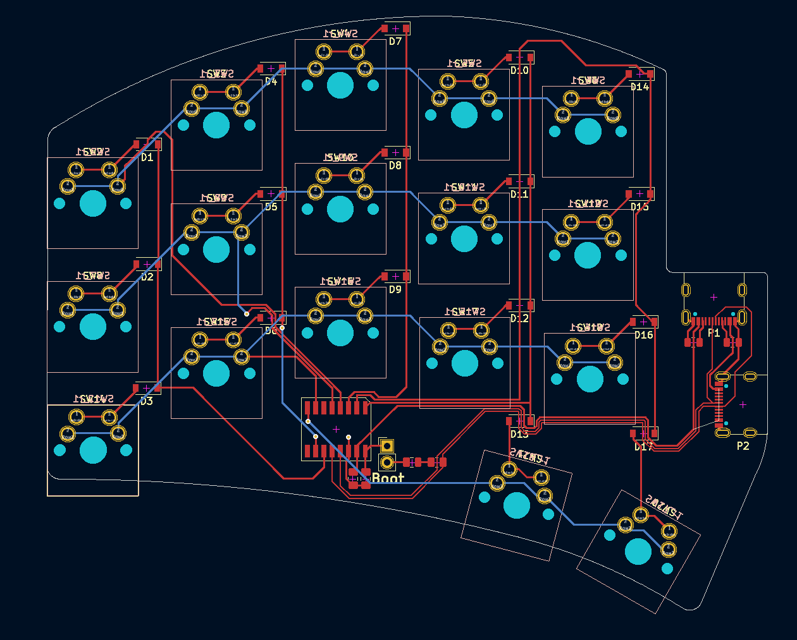

# street-sweep
A low cost version of the Ferris Sweep ergonomic keyboard.

Based on a [CH552G](https://raw.githubusercontent.com/WeActStudio/WeActStudio.CH552CoreBoard/master/Datasheet/CH552DS1_en.PDF) chip, this PCB can be completely constructed with all components apart from MX switches by JLCPCB for a total of €34.34 (5x PCBs), making for a per-keyboard cost of €13.74.

